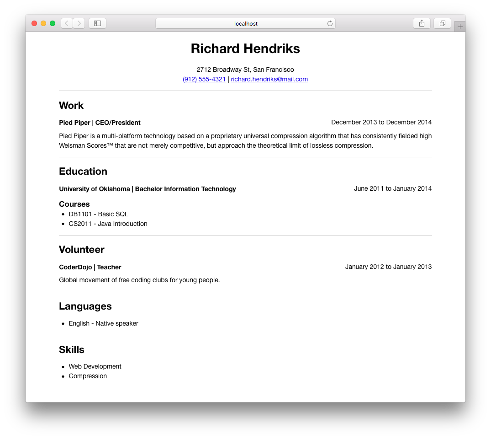

# Flex Resume 📝


Make resumes with JSON-data alongside your own markup and styles to easily make resumes completely your way. Just how any developer would like it! 😎



## Getting Started

    git clone https://github.com/mikeschenkel/flex-resume.git
    cd flex-resume
    npm install

## Usage

### `npm run start`

Use this command to start development. It fires up a server on `http://localhost:3000` and uses BrowserSync for live-reloading.

### `npm run build`

This compiles all necessary files and saves your resume in PDF format inside the `_resumes/` directory. Feel free to change this path to your liking in `config.js`. It also supports absolute paths. For example: `/Users/richardhendriks/Documents/Resumes/`.

### `npm run theme:new [themeName]`

Create a new blank-theme inside the `src/themes/` directory.

**Example:**

    npm run theme:new my-theme

### `npm run theme:install [gitRepo]`

Install a new theme from any Git repository.

**Example:**

    npm run theme:install https://github.com/mikeschenkel/basic-resume-theme.git

### `npm run theme:remove [themeName]`

Remove an already installed theme.

**Example:**

    npm run theme:remove basic

## Settings

You're able to change certain settings under `userSettings` in `config.js`.

```javascript
// User Settings
const userSettings = {
  theme: 'basic', // Current theme
  data: 'resume.json', // JSON-data file
  outputFilename: 'my-resume', // Export filename. PDF-extension will be added after build.
  outputDestination: '_resumes/' // Export directory. Also supports absolute paths.
};
```

## Data

All of your resume data is stored in `src/data/resume.json` by default.

Since you’ll want to be swapping different information in and out depending on the job you’re applying to, keep a master data-file where you keep any information you’ve ever included on a resume: old positions, special projects that only sometimes make sense to include. Then, when you’re crafting each resume, it’s just a matter of cutting and pasting relevant information together. You can achieve this by keeping a `resume.all.json` file as your master list and make a new file for each resume you're working on.

## Changelog

### 1.0

- Initial release

## License

[MIT](https://opensource.org/licenses/MIT)

Copyright (c) 2017-present, Mike Schenkel
